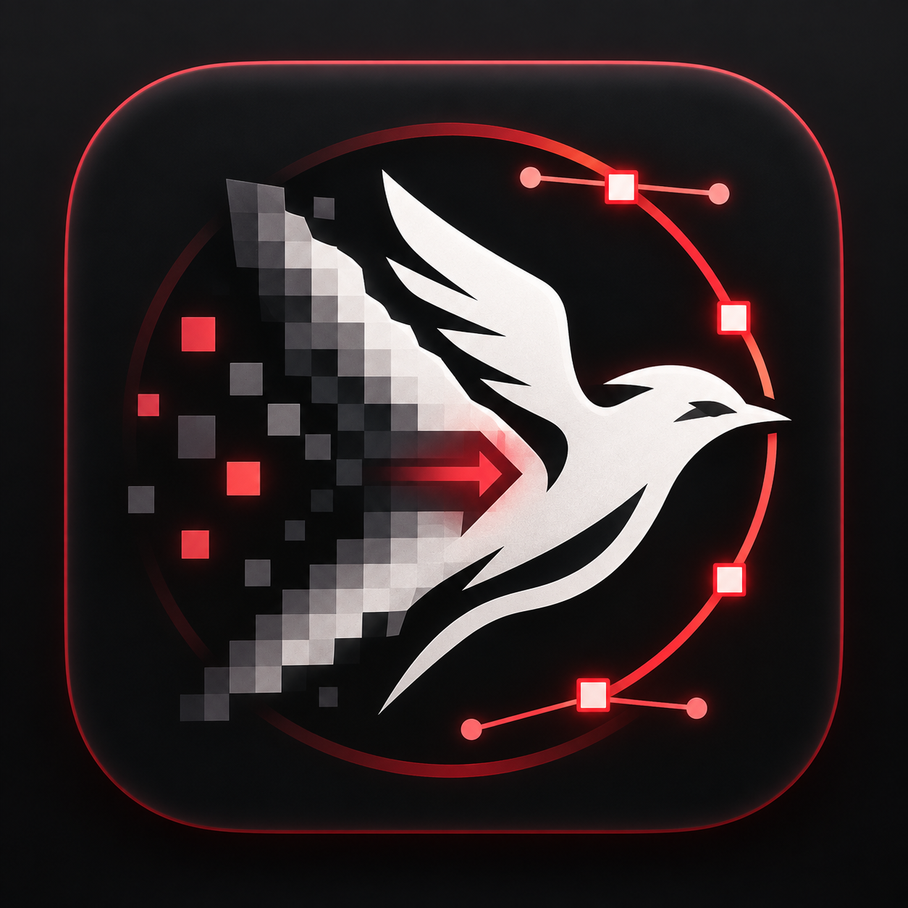
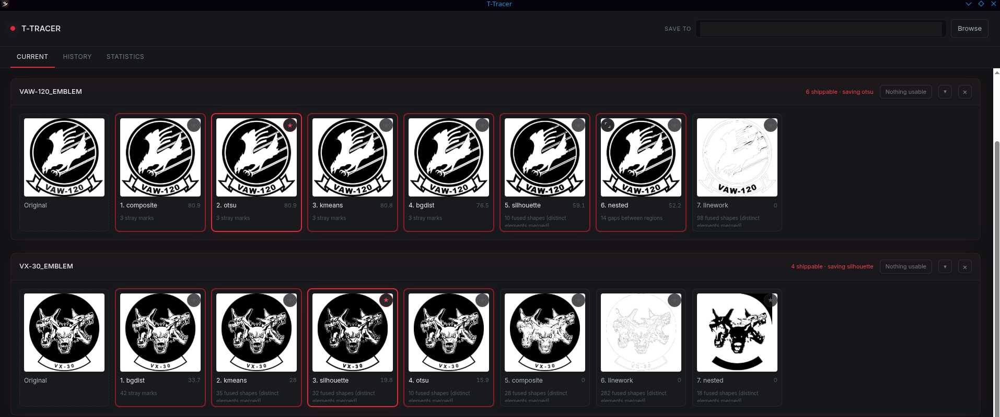
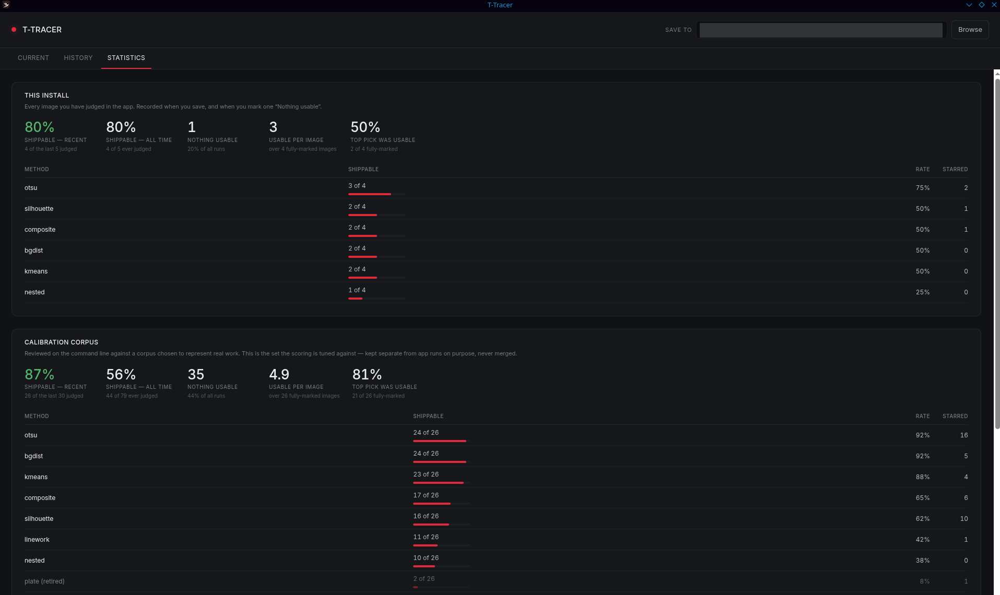

<div align="center">



# T-Tracer

**Turns a customer logo into a laser-ready SVG.**

Drop images in, pick the result that looks right, get clean closed-path
vectors out — no manual work in Illustrator.

</div>

Built for engraving on an xTool F2 Ultra UV, but the output is plain SVG and
works anywhere.

---

## Install

**Windows** — download `T-Tracer-Setup.exe` from
[Releases](../../releases/latest) and run it.

It installs Python and PyTorch if the machine does not already have them
(about 2 GB on first install, from python.org and PyPI). No admin rights
needed.

**Linux / macOS**

```bash
git clone https://github.com/JudgeBreddd/t-tracer.git
cd t-tracer/app
./install.sh
./T-Tracer
```

---

## How it works, and why it is built this way

Most auto-tracers give you one answer. This one gives you **seven**, from seven
different strategies, and asks you to choose.

That is not indecision. Tracing a logo for engraving has no single correct
answer — the same mid-luminance gold is *ink* on one crest and a *background
field* on another, and no threshold can tell those apart, because the
difference is structural rather than tonal. So the tool runs every strategy,
scores each result, and puts them side by side.

Measured over three calibration batches on real customer artwork:

| | |
|---|---|
| logos with at least one shippable result | **93%** (26 of 28) |
| shippable candidates per logo, on average | **4.9** |
| top-ranked candidate was shippable | **81%** |

That last number is the interesting one. The score is good at finding the
*neighbourhood* and unreliable at picking the winner, which is exactly why the
interface shows you pictures instead of a number.

### The strategies

| | |
|---|---|
| `otsu` | Global luminance threshold. The baseline, and still the most reliable single strategy. |
| `bgdist` | CIELAB distance from the detected background. Does not require the artwork to be darker than its surroundings. |
| `kmeans` | Colour clustering. |
| `linework` | Decides by stroke *thickness* rather than colour — a thin region is a line, a thick one is a field. |
| `silhouette` | Everything that is not background, thresholded **inside the artwork only**. Wins on saturated mid-tones that global thresholds drop. |
| `nested` | Ink as a 2-colouring of the containment tree: a region flips relative to the region that contains it. Uses a ControlNet lineart annotator for boundaries. |
| `composite` | `otsu` as the base, with `nested` allowed to punch holes in large solid fields. Answers the "everything went black" failure. |

`--strategies` also reaches `plate`, `neural`, `edges`, `sauvola`, `inotsu` and
`triotsu`, all of which lost their place on the default sheet by failing to win
picks. `triotsu` in particular is kept, with its failure documented in the
source, so nobody spends an afternoon rediscovering that three-class Otsu turns
a gold shield into a black blob.

### Deeper

**[HOW-IT-WORKS.md](HOW-IT-WORKS.md)** is the full technical tour — the mask →
contour → Bézier pipeline, how each strategy actually decides what is ink, the
scoring metrics and how far to trust them, the determinism fix, and why the
worker count is sized by free memory rather than core count.

### Command line

The app is a front end. Everything is available directly:

```bash
.venv/bin/python _scripts/candidates.py --in ./logos --out ./out
.venv/bin/python _scripts/pick.py --dir ./out
```

`--jobs 0` sizes workers by free memory rather than core count, and caps at
half the cores, so a batch does not take the machine down with it.

---

## What it looks like

Every image is traced seven ways and the results are laid out side by side.
Click the ones you would actually send to a customer, star the one to keep.



Any candidate opens at full size beside the original, because judging whether a
hairline survived is a comparison, not a glance. Arrow keys move along the
slate.

The Statistics tab reports what actually happened — per-strategy reliability and
how often nothing was usable. Your own runs and the calibration corpus are kept
separate and never averaged together.



---

## Contributing

Bug reports and pull requests welcome — see [CONTRIBUTING.md](CONTRIBUTING.md).

The most useful bug report is **an image it fails on**, plus which strategy got
closest and what is wrong with it. Roughly 1 logo in 14 still defeats every
strategy; those are the interesting ones.

## Licence

MIT — see [LICENSE](LICENSE).
